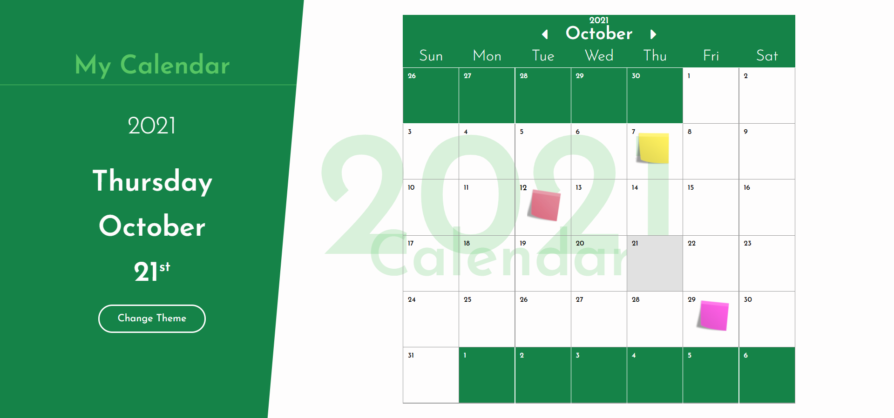
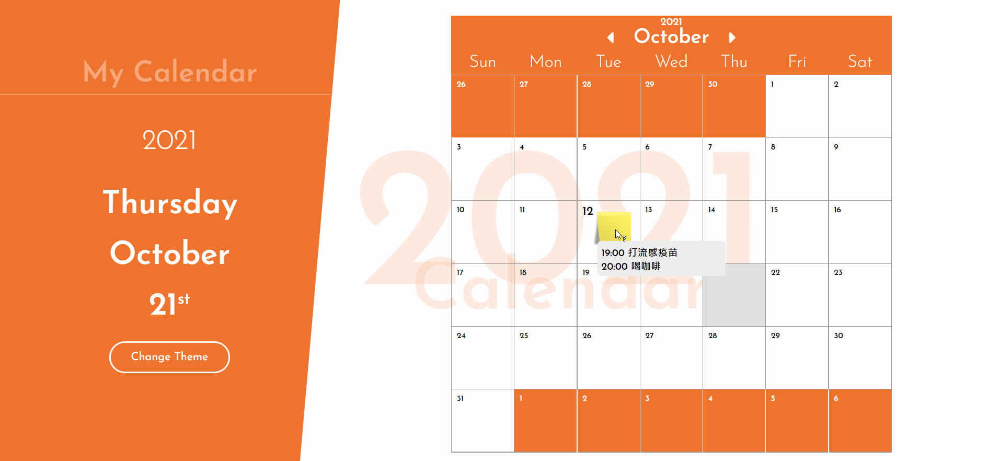
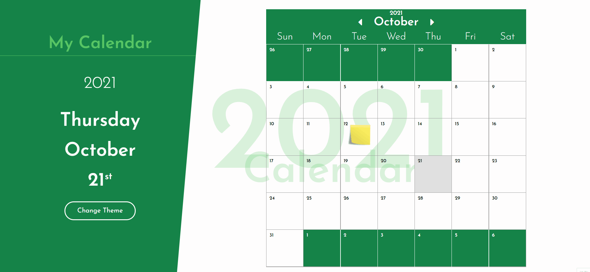
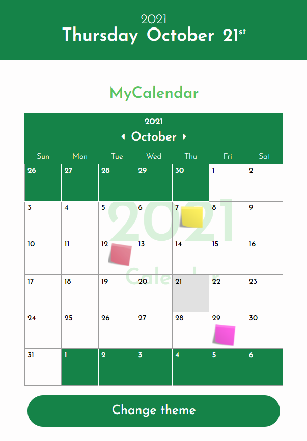

## 簡易行事曆 Calendar

[線上展示](#)

## 網站應用的技術
* JavaScript 應用 : DOM 操作
* CSS-RWD 應用 : [RWD-手機版面](#mobileView)
* PHP 資料庫操作-CURD 應用: 
    * CRUD-Create : [新增記事](#addNote)
    * CRUD-Read : [顯示記事內容](#showNote)
    * CRUD-Delete : [刪除記事](#deleteNote)
    * CRUD-Update : [更改記事](#editNote)、[變更主題色彩](#editTheme)

## 功能介紹

<h3 id="showNote">顯示記事內容</h3>

<h3 id="addNote">新增記事</h3>

<h3 id="deleteNote">刪除記事</h3>

<h3 id="editNote">更改記事</h3>

<h3 id="editTheme">變更主題色彩</h3>

<h3 id="mobileView">RWD-手機版面</h3>
